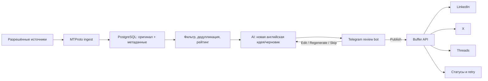

# Telegram → AI draft → Telegram approval → LinkedIn/X/Threads

Исследование актуально на **21 июля 2026 года**.

## Короткий ответ

**Технически — да, весь workflow реализуем.** Старую историю публичных Telegram-каналов можно получить без веб-скрейпинга и Computer Use: либо штатным экспортом Telegram Desktop, либо программно через пользовательский Telegram API (MTProto). Для регулярной синхронизации 25 источников правильнее MTProto-клиент, а не UI-автоматизация.

Но исходный сценарий в формулировке «собрать чужие посты → отдать AI → почти дословно перевести → убрать имена → публиковать от себя» нельзя считать готовым к безопасному запуску:

1. Текущие [Telegram Terms for Content Licensing](https://telegram.org/tos/content-licensing) запрещают scraping, harvesting, aggregation и использование данных Telegram для разработки, улучшения или deployment AI/ML, кроме случая явного, информированного и продолжающегося согласия всех релевантных авторов на конкретный контент/канал. Это ограничение продублировано в [Telegram API Terms](https://core.telegram.org/api/terms).
2. Перевод — не способ обнулить авторские права. Статья 8 Бернской конвенции закрепляет за автором исключительное право разрешать перевод произведения ([WIPO, Article 8](https://www.wipo.int/edocs/pubdocs/en/wipo_pub_287-accessible1.pdf)).
3. Простая замена «Даня» на «мой знакомый», а «Aura» на «моя компания» способна создать ложное утверждение о личном опыте. Это уже не обезличивание, а выдуманная биография.

**Рекомендуемый вариант:** система работает только с собственными материалами, источниками с явным разрешением либо контентом, импортированным из источника с подходящей лицензией. AI извлекает идею и создаёт новый текст на основе предоставленных фактов автора; он не делает построчный перевод и не придумывает личный опыт.

## Что выяснилось про Telegram

### 1. Штатный экспорт действительно существует

Telegram официально описывает два режима в **Telegram Desktop**:

- `Settings → Advanced → Export Telegram Data` — общий экспорт;
- меню `⋮` конкретного чата → `Export chat history` — точечный экспорт одного чата.

Экспорт доступен в HTML и машиночитаемом JSON. Это описано в [официальном анонсе Telegram](https://telegram.org/blog/export-and-more) и в [официальной карточке поддержки](https://bugs.telegram.org/c/60/6).

Публичный канал сам по себе не является исключением. Известный особый случай — группы с Topics: пункт экспорта может не отображаться в режиме тем; переключение в `View as Messages` возвращает экспорт, но JSON/HTML может терять понятную привязку к темам ([issue Telegram Desktop](https://github.com/telegramdesktop/tdesktop/issues/27322)).

### 2. Почему на этом Mac нужной кнопки могло не быть

Локально установлен **Telegram for macOS 12.9**, bundle `ru.keepcoder.Telegram`. Это нативный macOS-клиент, не Qt-приложение **Telegram Desktop**. Telegram сам перечисляет их как два разных клиента; в FAQ экспорт прямо указан как возможность Telegram Lite/мультиплатформенного клиента ([официальный список приложений](https://telegram.org/apps/desktop), [Telegram FAQ](https://www.telegram.org/faq)).

То есть наблюдение пользователя правдоподобно: искалась функция не в том macOS-клиенте. Для ручной проверки нужен Telegram Desktop для macOS с [официальной страницы](https://telegram.org/desktop/download). Установка не обязательна для будущего программного решения.

### 3. Программная выгрузка старой истории

Официальный MTProto-метод [`messages.getHistory`](https://core.telegram.org/method/messages.getHistory) возвращает историю выбранного peer и поддерживает пагинацию по ID и дате. Важно: этот метод доступен **пользовательским аккаунтам**, а не обычному Bot API.

Практический клиент — Telethon. Его [`iter_messages`](https://docs.telethon.dev/en/stable/modules/client.html#telethon.client.messages.MessageMethods.iter_messages) умеет проходить историю канала, использовать `offset_date`, менять порядок и корректно пережидать flood limits.

Что доступно:

- публичный канал, который открывается аккаунту;
- приватный канал/группа, где аккаунт состоит;
- текст, дата, message ID, URL/peer, подпись автора там, где Telegram её предоставляет;
- последующая инкрементальная синхронизация только новых message ID.

Что может быть недоступно:

- удалённые сообщения;
- приватный источник, к которому у аккаунта нет доступа;
- часть очень старой истории в редких серверных случаях;
- корректное авторство в анонимных каналах: там автором поста технически является канал;
- сохранение/пересылка защищённого контента может быть ограничено настройками источника.

### 4. Почему Bot API не решает backfill

Bot API получает новые `message`/`channel_post` updates после подключения бота и не предоставляет произвольную старую историю чужого канала. [`getUpdates`](https://core.telegram.org/bots/api#getupdates) — очередь недавних updates, а не архив. Bot API подходит для интерфейса согласования, но не для первоначального сбора.

### Вывод по способам сбора

| Способ | 90-дневный backfill | Регулярный sync | Надёжность | Вердикт |
|---|---:|---:|---:|---|
| Telegram Desktop JSON | Да, вручную по чатам | Плохо | Средняя | Одноразовый PoC |
| MTProto/Telethon | Да | Да | Высокая | Основной путь, только для разрешённых источников |
| Web scraper | Хрупко | Хрупко | Низкая | Не использовать |
| Computer Use | Теоретически | Плохо | Очень низкая | Только аварийный ручной fallback |
| Bot API | Нет | Только новые доступные updates | Высокая | Только approval-интерфейс |

## Важная математика очереди

Три публикации в день не позволят быстро «догнать» полный архив:

- 1 000 постов / 3 в день = **333 дня**;
- 5 000 постов / 3 в день = **1 667 дней**, или 4,6 года;
- чтобы обработать 1 000 постов за 45 дней, нужно публиковать **22 в день**.

Очередь перестаёт расти только если скорость публикации выше скорости поступления. Даже если каждый из 25 источников публикует всего два раза в неделю, это в среднем 7 новых кандидатов в день — больше планируемых трёх публикаций.

Поэтому хранить можно всё разрешённое, но в редакторскую очередь должны попадать только лучшие **5–15%**. Нужны:

- тематический фильтр;
- дедупликация одинаковых идей;
- оценка релевантности личному бренду;
- срок годности кандидата;
- лимит от одного источника, чтобы один активный канал не занял всю очередь;
- пометка `evergreen` / `time-sensitive`;
- ручная кнопка «не нравится автор/тема» для обучения правил отбора, а не модели на Telegram-данных.

## Рекомендуемая архитектура



### Компоненты

1. **Ingest worker**
   - allowlist источников;
   - обязательное поле основания использования: `owned`, `licensed`, `explicit_consent`;
   - отдельный Telegram-аккаунт, в котором нет личных переписок и есть доступ только к разрешённым источникам;
   - 90-дневный backfill один раз;
   - далее sync каждые 1–6 часов по `last_message_id`;
   - text-only для первой версии.

2. **PostgreSQL**
   - размер задачи маленький; Postgres нужен не ради объёма, а ради надёжных статусов, блокировок и retries;
   - отдельный Redis для MVP не нужен; очередь можно реализовать через Postgres и `FOR UPDATE SKIP LOCKED`.

3. **Candidate selector**
   - сначала дешёвые правила и dedupe hash;
   - AI вызывается только для выбранного кандидата, а не для всего архива;
   - старейший пост не всегда лучший: time-sensitive материалы должны истекать, evergreen можно сортировать по дате.

4. **Draft generator**
   - делает разные варианты под платформы;
   - LinkedIn допускает до 3 000 символов ([LinkedIn Help](https://www.linkedin.com/help/linkedin/answer/a528176/)); длинный материал для X/Threads превращается в короткий пост или thread;
   - отдельный факт-чек: личные утверждения разрешены только из профиля фактов пользователя.

5. **Telegram approval bot**
   - показывает ссылку/краткое резюме разрешённого источника и три адаптированных варианта;
   - кнопки `Edit`, `Regenerate`, `Skip`, `Publish`;
   - редактирование: пользователь отвечает боту исправленным текстом;
   - `Publish` является явным финальным подтверждением;
   - после отправки бот показывает статус каждой сети и кнопку `Retry failed`.

6. **Publisher**
   - для v1 — Buffer;
   - публикация в три сети не атомарна: возможен успех в двух и ошибка в третьей, поэтому нужны отдельные publication records и idempotency keys.

## Почему для v1 лучше Buffer

Buffer сейчас поддерживает публикацию через единый GraphQL API в **Threads, LinkedIn и X/Twitter** ([официальная документация](https://developers.buffer.com/guides/posts-and-scheduling.html)). API доступен на всех планах. Free-план позволяет подключить ровно три канала, создать один API key и сделать до 3 000 API-запросов в месяц ([Buffer API Help](https://support.buffer.com/article/859-does-buffer-have-an-api), [текущие планы](https://support.buffer.com/article/595-features-available-on-each-buffer-plan)). Это практически идеальное совпадение с данным MVP.

Ограничение Free — одновременно не более 10 запланированных постов на канал. В предлагаемой схеме публикация происходит сразу после кнопки пользователя, поэтому это не проблема.

Прямые API тоже возможны:

- LinkedIn: `POST /rest/posts`, scope `w_member_social` ([Posts API](https://learn.microsoft.com/en-us/linkedin/marketing/community-management/shares/posts-api));
- X: `POST /2/tweets`, OAuth user token; X API сейчас pay-per-usage, создание контента указано как $0.015 за запрос ([Create Post](https://docs.x.com/x-api/posts/create-post), [pricing](https://docs.x.com/x-api/getting-started/pricing));
- Threads: создание text container и затем publish, permissions `threads_basic` и `threads_content_publish` ([официальная Meta Postman collection](https://www.postman.com/meta/threads/documentation/dht3nzz/threads-api)).

Прямой путь добавляет три OAuth-flow, хранение/обновление токенов, различия API и app review. Его стоит рассматривать после работающего MVP, если Buffer станет ограничивать нужную функцию или будет экономически невыгоден.

## Минимальная модель данных

```text
source
  id, telegram_peer_id, username, title
  rights_basis, consent_evidence, ai_allowed
  last_message_id, last_synced_at, active

source_post
  id, source_id, telegram_message_id, source_url
  posted_at, text, text_hash, language
  status, expires_at, created_at

candidate
  id, source_post_id, score, score_reasons
  topic, evergreen, status

draft
  id, candidate_id, prompt_version, model
  linkedin_text, x_parts_json, threads_parts_json
  unsupported_claims_json, status, edited_at

publication
  id, draft_id, platform, idempotency_key
  status, external_post_id, error, published_at

audit_event
  id, entity_type, entity_id, action, payload, created_at
```

Статусы черновика: `queued → generated → awaiting_review → edited → approved → publishing → published|partial_failure|failed`; отдельно `skipped` и `expired`.

## Системный промпт для безопасного генератора

```text
You are an English-language editorial assistant.

The source is provided only because its owner has authorized this use.
Use it as research input, not as text to translate or closely paraphrase.

Rules:
1. Extract the central idea, then write a substantively original post with a
   different structure, examples, phrasing, opening, and conclusion.
2. Never invent first-person experience, friends, clients, employers, company
   facts, results, revenue, dates, or conversations.
3. Use first-person claims only when supported by AUTHOR_FACTS.
4. If a useful personal detail is missing, insert [ADD TRUE PERSONAL EXAMPLE]
   and list it in unsupported_claims. Do not silently generalize a named person
   into “my friend” or a named company into “my company”.
5. Do not include private or identifying information. Retain a public name only
   for an attributed short quotation or when the user explicitly requests it.
6. Preserve factual meaning, but flag every claim that needs verification.
7. Produce native variants, not one identical string:
   - LinkedIn: concise professional post;
   - X: one post if it fits, otherwise an ordered thread;
   - Threads: one post if it fits, otherwise an ordered thread.
8. Output valid JSON only:
   source_thesis, originality_changes, linkedin_text, x_parts,
   threads_parts, unsupported_claims, factual_claims_to_check.
```

## План MVP

### Этап 0 — права и входные данные (обязателен)

- выбрать 3 тестовых источника, которыми пользователь владеет или на которые есть явное разрешение;
- сохранить подтверждение и scope разрешения;
- получить список `@username`/invite links;
- определить достоверные `AUTHOR_FACTS`, которые AI вправе использовать от первого лица.

### Этап 1 — проверка ingest

- создать Telegram `api_id`/`api_hash` на `my.telegram.org`;
- авторизовать отдельную MTProto-сессию сервисного аккаунта;
- скачать **3 дня из 3 источников**;
- сверить количество и поля вручную;
- только после успешной сверки выполнить 90-дневный backfill.

Критерии успеха: 100% доступных текстовых постов за тестовый интервал, корректные source/date/message ID, отсутствие дублей при повторном запуске.

Файл MTProto session фактически является credential с доступом к аккаунту. Его, `api_hash`, bot token и Buffer key нельзя присылать в чат или коммитить в Git: они настраиваются локально через `.env`/secret manager.

### Этап 2 — отбор и Telegram review

- Postgres schema;
- cron/scheduler три раза в день;
- draft generator с JSON output;
- `Edit / Regenerate / Skip / Publish`;
- журнал всех пользовательских действий.

### Этап 3 — Buffer

- подключить LinkedIn, X и Threads к Buffer;
- создать API key только с необходимыми правами;
- сначала публиковать в тестовом режиме/черновик, затем сделать один реальный тестовый пост;
- добавить per-platform retry и уведомление о partial failure.

### Этап 4 — continuous sync

- sync новых постов каждые несколько часов;
- source quotas, expiration и dedupe;
- метрики: candidates/day, approval rate, edit rate, publish failures, engagement по платформам.

## Оценка усилий и стоимости

При наличии доступов и трёх разрешённых тестовых источников:

- ingest PoC: 0,5–1 день;
- база + selector + generator: 1–2 дня;
- Telegram review bot: 1–2 дня;
- Buffer publishing + retries: 1 день;
- развёртывание, логирование, backup, smoke tests: 1 день.

Итого реалистичный MVP: **4–7 рабочих дней**. Прямые интеграции вместо Buffer добавят ориентировочно 3–7 дней и риск задержек из-за OAuth/app review.

Операционные расходы для такого объёма невелики: маленький сервер с Postgres, AI-вызовы только для 60–100 утверждаемых кандидатов в месяц и Buffer Free на три канала. Точную стоимость AI следует считать после выбора модели и средней длины источника.

## Итоговое решение

1. **Не устанавливать Computer Use и не писать web scraper.** Они не нужны.
2. Для ручного одноразового теста можно поставить официальный Telegram Desktop и экспортировать конкретный разрешённый канал в JSON.
3. Для продукта использовать MTProto/Telethon, но только с allowlist и зафиксированным правом на AI-обработку.
4. Не переводить чужой текст «как есть». Создавать новый материал вокруг идеи и только из достоверных фактов пользователя.
5. Не пытаться публиковать весь архив. Хранить всё разрешённое, публиковать верхние 5–15%.
6. Для v1 использовать Telegram bot + PostgreSQL + Buffer API. Это минимальная по сложности и стоимости конфигурация.

Следующая необходимая входная информация для реализации: три разрешённых тестовых источника, подтверждение прав/согласия, локально созданные Telegram API credentials и bot token, Buffer account с тремя подключёнными каналами и выбранные часы публикации в часовом поясе пользователя. Секреты остаются в локальном `.env` и не передаются сообщением.
